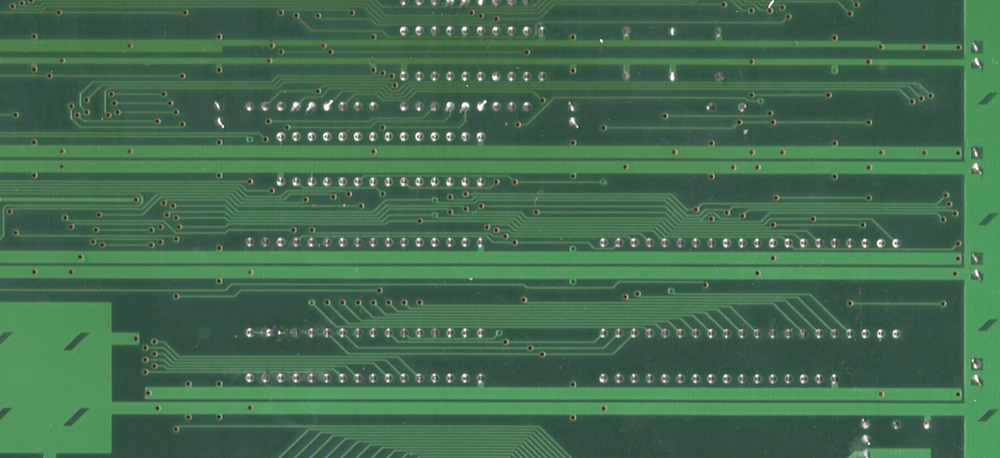

# openkey-kabuki
* [Overview](#overview)
* [Project Status](#project-status)
* [Supported Games](#supported-games)
  * [Mitchell](#mitchell)
  * [CPS 1.5 (QSound CPU)](#cps-15-qsound-cpu)
* [Hardware](#hardware)
  * [PCB Manufacturing](#pcb-manufacturing)
  * [BOM](#bom)
  * [Assembly](#assembly)
* [Programming](#programming)
  * [Hardware](#hardware-1)
  * [Software](#software)
* [Arcade PCB Prep](#arcade-pcb-prep)
  * [Mitchell](#mitchell-1)
  * [CPS 1.5 (QSound CPU)](#cps-15-qsound-cpu-1)

## Overview
This is an opensource/hardware implementation of an on the fly kabuki CPU key programmer that consists of a PCB that sits between the CPU socket and the kabuki CPU.  The kabuki CPU is found in Mitchell and CPS 1.5 arcade boards and contains keys for decrypting/decoding the program roms.

Installed: 

This project is providing the same functionality as [Undamned's InfiniKey-Kabuki](https://www.arcade-projects.com/threads/infinikey-kabuki.8338/).  The lack of supply is what prompted me to make openkey-kabuki.  If they ever end up coming back in stock please consider purchasing those to support [Undamned](https://www.arcade-projects.com/forums/temple-of-the-undamned.77/)'s work.

Details on *how* to program a kabuki CPU's key data can be found in [Eduardo Cruz](http://arcadehacker.blogspot.com/)'s [write up](http://arcadehacker.blogspot.com/2014/11/capcom-kabuki-cpu-intro.html) and [youtube video](https://www.youtube.com/watch?v=9t-9hQEOjLI).

Details on *what* to program can be found in MAME's decryption code for the [kabuki CPU](https://github.com/mamedev/mame/blob/master/src/mame/capcom/kabuki.cpp#L73).

## Project Status
**PCB:** I would consider the design PCB done at this point.  I'm open to any input on changes/improvements as this is my first PCB design.

**Firmware:** Need to get untested games tested

**Documentation:** Done

## Supported Games
openkey-kabuki supports either having a 5 position switch or using solder jumpers for picking which game key to use.  For the switch, ensure the switches are fully set.  You should hear a click sound as you change the position.

Below is a list of supported games and what switches/jumpers must be used for each.

#### Mitchell
| Switch 12345 | Program ROM Labels | MAME Sets | Game Names | Tested / Working |
|-----------------|:------------------:|-----------|--------------|:-----------------:|
| 00000 | BLE BLJ | block blockj | Block Block | YES (conversion)|
| 00001 | CBJ | cbasebal | Capcom Baseball | |
| 00010 | CW | cworld | Capcom World | |
| 00011 | D2 | dokaben2 | Dokaben 2 | YES (conversion) |
| 00100 | DB | dokaben | Dokaben | YES (conversion) |
| 00101 | MG2 | mgakuen2 | Mahjong Gakuen 2 Gakuen-chou no Fukushuu | YES |
| 00110 | MG3 | marukin | Super Marukin-Ban | |
| 00111 | PK PKO | pkladiesl pkladies | Poker Ladies | |
| 01000 | PWE PWJ PWU | pang pompingw bbros | Pang Pomping World Buster Bros | YES |
| 01001 | Q2 | hatena | Adventure Quiz 2 - Hatena? no Daibouken | |
| 01010 | Q3 | qtono1 | Quiz Tonosama no Yabou | |
| 01011 | Q4 | qsangoku | Quiz Sangokushi | |
| 01100 | SPE | spang | Super Pang (World) | YES |
| 01101 | SPJ | spangj | Super Pang (Japan) | YES |
| 01110 | SPU | sbbros | Super Buster Bros | YES |
| 01111 | ??? | ??? | Ashita Tenki ni Naare  (place holder) | |

#### CPS 1.5 (QSound CPU)
| Switch 12345 | Program ROM Labels | MAME Sets | Game Names | Tested / Working |
|-----------------|:------------------:|-----------|--------------|:-----------------:|
| 10000 | CDE CDJ CDT CDU | dino dinoj dinoa dinou | Cadillacs and Dinosaurs |
| 10001 | MBE MBJ MBU MBDE MBDJ | slammast mbomberj slammastu mbombrd mbombrdj | Saturday Night Slam Masters Muscle Bomber Muscle Bomber Duo | |
| 10010 | PSE PSH PSJ PSE | punisher punisherh punisherj punisheru | Punisher | YES |
| 10011 | TK2A TK2E TK2J TK2U | wofa wof wofj wofu | Warriors of Fate | |

## Hardware
---
#### PCB Manufacturing
You will want to pick **0.8mm PCB thickness** instead of the default of 1.6mm.  A 1.6mm thick PCB will make the legs on openkey-kabuki to be a little to short and cause it to not be fully secure in the CPU socket.

I've been using [jlcpcb](https://jlcpcb.com/) for PCB manufacturing.  The only real downside I've seen with them is they charge a fee (~$17) if you pick a color other then green or black with 0.8mm PCB thickness.  Also watch out, by default they will add an order number to the silk screen unless you tell them not to.

#### BOM
| Description | Part Number | DigiKey | Mouser | Notes |
|-------------|-------------|---------|--------|-------|
| 40 Pin Dip Machine Socket | Adam Tech ICM-640-1-GT-HT | [2057-ICM-640-1-GT-HT-ND](https://www.digikey.com/en/products/detail/adam-tech/ICM-640-1-GT-HT/9832971) | | The specific part number isn't required, but it must be a machined 40 pin dip socket with the cross members in the same locations as seen in the picture at the top of this page. This [part](https://www.aliexpress.us/item/2251832711755702.html) from Aliexpress worked for me as well. |
| ATtiny404 20Mhz | ATTINY404-SSN | [ATTINY404-SSN-ND](https://www.digikey.com/en/products/detail/microchip-technology/ATTINY404-SSN/9947546) | [556-ATTINY404-SSNR](https://www.mouser.com/ProductDetail/Microchip-Technology-Atmel/ATTINY404-SSNR?qs=F5EMLAvA7IAEqD7Aw0z%252B9Q%3D%3D) | Other ATtiny tinyAVR 0/1/2-series models should be viable as well.  The code compiles to just over 1K in size, so any that have 2k or more of flash should work.  Just note I have only tested with 404s |
| 100nf / 0.1uf SMD Ceramic Capacitor 0805 Size | | | | |
| 5 Position Slide Switch | Würth Elektronik 416131160805 | [732-3855-2-ND](https://www.digikey.com/en/products/detail/w%C3%BCrth-elektronik/416131160805/3174531) | [710-416131160805](https://www.mouser.com/ProductDetail/Wurth-Elektronik/416131160805?qs=2kOmHSv6VfT1rqUsojuQog%3D%3D) | **Optional** not needed if using the solder jumpers to pick the game.  This part more then doubles the BOM cost. |

**NOTE**: Additional components maybe needed if you need to revert any previously made desuicide modifications to the arcade PCB.  Check the Arcade PCB Prep section at the bottom for details.

#### Assembly
The first thing you should do is a test fit of the socket into the openkey-kabuki PCB.  I came across a couple PCBs in a batch that didn't fit and wasn't until after I had soldered the SMD components that I found this out.

As you can see in the first socket in the picture below the pins start out wide then go skinny.  Normally the wide part is used to keep the socket up off a board, however the openkey-kabuki PCB has extra wide through holes to allow it to sit flush with the plastic part of the socket.  Doing this allows the pins from the socket to be long enough to fit properly into the CPU socket of the arcade board.

You should solder the SMD components first.  Take special care to void getting any solder into any of the socket through holes.

  * If you install the dip switch block I would advise testing it
  * If you are using the solder jumpers instead, these can be done now or after everything is fully assembled.

When soldering the socket its best to not use a ton of solder.  The below picture is a board where the socket hasn't been soldered in yet.

Note the small gap between the through holes and socket pins.  Solder will naturally want to wick up into that gap.  I generally just use enough solder so that the gap around the socket pin becomes filled.

Once you have completed soldering the socket you should check the skinny part of the pins to verify there aren't any solder blobs on them.  These could cause damage to the CPU socket.

## Programming
#### Hardware
Programming is done with a UPDI programmer.  I've been using this one:

[Serial UPDI Programmer for ATmega 0-Series, or ATtiny 0-Series or 1-Series, or AVR DA or AVR DB](https://www.amazon.com/dp/B09X64YRLD?psc=1&ref=ppx_yo2ov_dt_b_product_details)

The openkey-kabuki programming port is setup so you can wedge the pins from the above programmer directly into them to programming.

Of course be sure you properly orient the board so the labeled pin/holes match up.  vcc to vcc, gnd to gnd, and updi to updi.

#### Software
For software I've been using the [Arduino IDE](https://www.arduino.cc/en/software/OldSoftwareReleases) with [megaTinyCore](https://github.com/SpenceKonde/megaTinyCore), which adds support for tinyAVR 0/1/2-Series MCUs.

**NOTE**: The makers of megaTinyCore currently recommend using Arduino IDE version 1.8.13 for best compatibility.  2.0 definitely does not work!

To install the megaTinyCore you, should just need to add http://drazzy.com/package_drazzy.com_index.json to "Additional Boards Manager URLs" in the settings for the Arduino IDE.

From there you need to configure the board/programming settings.  I've been using these:

## Arcade PCB Prep
Its possible the arcade PCB may already have had some type of desuicide mod done to it.   The most common is going to be [The Dead Battery Society](http://www.arcadecollecting.com/dead/) mod, which consists of disabling the decryption on the kabuki CPU and replacing the program rom(s).

#### Mitchell
This is what a dead battery society mod will look like

 * R33 (1k ohm resistor) is missing
 * Right through hole of R33 is bridged to the lower right
 * Those pins on the program roms are soldered together and have a wire from them to a pin on the cpu
 * Modified program roms

 All of these things will need to be reverted in order to use openkey-kabuki.  This is what an unmodified board should look like.

 

#### CPS 1.5 (QSound CPU)

This is what the dead battery society mod will look like on the QSound board of a cps 1.5 game.

Top Side: 

* R33 (1 ohm resistor 0805 size) is missing
* C12 (100nf capactor 0805 size) is replaced with a jumper
* Modified QSound program rom

Bottom Side: 

* Wire running from QSound program rom pin 30 to Kabuki CPU pin 27
* Cut trace between QSound program rom pins 30 and 31

There will be additional changes specific to slam masters / muscle bomber which are not covered above.

Once reverted it should look like this

Top Side: 

Bottom Side: 

Its hard to tell from the picture, but pins 30 and 31 on the QSound program rom are jumpered together.
